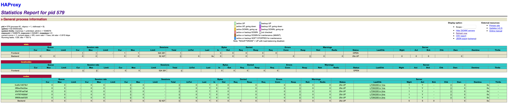
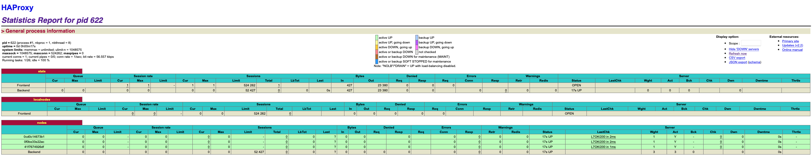

# Lab 04 - Docker

**Authors: Michaël da Silva, Nenad Rajic, Stefan Dejanovic**

### Table of content

[TOC]

### Introduction

This lab consist of setting up a load balancer with web servers like previously but with more web servers running and doing that dynamically. We want that each time a web server join or leave the cluster, the load balancer detects it and acts accordingly. 

### Task 0: Identify issues and install the tools

**[M1]** No, we can't use this solution as seen for a production environment. There are several problems to fix before testing and deployment.

- Problem 1: There is only **two working nodes** and they are **hard-coded** in the files for the creation of the nodes. That's certainly not enough if we want to absorb and process the pick of traffic due to the holiday season. We need to **dynamically add and remove servers** according to the traffic and **without** **hard-coded configuration** (ex: **dynamic IP**).
- Problem 2: The bug that restart a container **needs to be fix** before to be in production. While this bug is already bad with a normal traffic, it could **seriously damage** the **brand image** of the website while in the holiday season, because of a **bigger traffic**, a **bigger number of potential clients** and so a **bigger number of failure** and **bad publicity** during the holiday season.


**[M2]** To add a new `webapp` node to the infrastructure, we need to add the node into the config file of **HAProxy** (`haproxy.cfg`) in the `backend nodes` section.  We do that into the **load balancer container**, we restart **HAProxy** and start the new node and it should be operational.


**[M3]** We should manage the addition of new nodes **dynamically** without **modifying the config file manually** each time by detecting the new nodes and add them in the cluster, and the same when we stop them / remove them.


**[M4]** The `webapp` node should **announce** their creation and availability to the load balancer and the load balancer should detect them **automatically**. We then would configure a **pool of IP addresses** in the load balancer config and the nodes created would **choose an available IP** to connect to the load balancer.


**[M5]** Our current solution doesn't let us to run multiple processes in the same container. We need a **process supervisor** to do that.


**[M6]**  It is not really dynamic because we need to **write manually the new nodes into the script** and restart the service to be applied. 

Like we explained at question **M4** one of the solution should be to let the nodes **announce them-self to the load balancer** each time they are created, like a **cluster**. And then a script or a service **modify on the fly** the configuration file of the load balancer before restarting the load balancer to apply the modification.


**Deliverables**

1. The images of the load balancer and the web server are functioning correctly.


2. **URL of our repository:** https://github.com/Michael-DaSilva/Teaching-HEIGVD-AIT-2020-Labo-Docker


### Task 1: Add a process supervisor to run several processes

**Deliverables**

1. 

2. During this task we didn't get difficulties by following the instructions and they were clear and simple.

   Regarding the use of a supervisor this one helps us to bypass the designs limit of Docker: **one process by container**. Because we need more than one process in the containers to manage correctly our infrastructure we need this **process supervisor**, `S6`.


### Task 2: Add a tool to manage membership in the web server cluster

**Deliverables**

1. For this task, the logs of `ha`, `s1` and `s2` are stored in the `logs` directory, into `task2`.

   During this task we didn't have problems running the containers with Serf. But the current solution is not complete enough to work perfectly. 

2. If we start `ha` before the nodes the **Serf** service won't start until the nodes are up. And when the nodes are up but not `ha` they will return an error with Serf because they can't reach `ha`. We need a solution where `ha` starts first and then the nodes can connect to `ha` with Serf dynamically.

3. Concerning **Serf** and how it's working, the principle is simple: **Serf** uses what they call a **gossip protocol** that broadcasts messages to the cluster. Just like with **humans and gossips** the nodes in the cluster **exchange informations randomly** and these informations **spread to the other nodes**.

   One of the other way would be to use what Docker provide to us: **label of the containers**. We could use a software/container that **read the label of a container** (service obtained with the Docker Engine) to know from which image it was created. If the containers have the label of `node` for example the load balancer could know, via a service, that a new `node` container is created or down.


### Task 3: React to membership changes

**Deliverables**

1. For this task, again the logs are available in the `logs` directory into `task3`.


​	If we check the logs of `ha` all the installed services are running and it detects the two `webapp` nodes that joined the cluster.


​	We can see the same informations in the logs of `s1` (nodes connected to the cluster) and the logs of the web server running.


​	Finally, `s2` node has the same information that `s1`. If we kill one of the node, the load balancer detect it and spread the information to the others nodes.


2. For the logs inside the `haproxy` container here is the content:


​	We can see there is indeed the 3 containers we ran.

### Task 4: Use a template engine to easily generate configuration files

**Deliverables**

1. To reduce the image one of the best way to do that is to do like the second example:

```
  RUN command 1 && command 2 && command 3
```
Because it will reduce the number of layer. If we do it like the first example it will have 3 layers and with this one it will only have one layer.

For Docker squashing, the objective is to flatten the image as much as possible. To do that it change all multiple layer in one layer to be smaller.

For Docker flattening, it will take all exisiting layers and export the as a single file system image (.tar). And then when we want to use it, we will import it but we must to be carefull because the history of container is not perserve. 

```
docker export # Flatten
docker import # Import when using
```

--------------------------------------

// TODO QUESTION 2

2. We should have a **base image** containing the **files and services needed by the 2 types of container** and then create their own image from the base one. It **avoids repetitions** between the images and let us reuse the base image to make others later (that need the same services / os / files).

--------------------------------------


3. In the folder logs/task4 you can find all file for this delivery.

   1_haproxy.cfg → Configuration file after ha started
   2_haproxy.cfg → Configuration file After s1 started
   3_haproxy.cfg → Configuration file After s2 started
   dockerps.txt  → Information about docker ps  
   dockerInspectHa.txt → Information about docker inspect ha  
   dockerInspectS1.txt → Information about docker inspect s1  
   dockerInspectS2.txt → Information about docker inspect s2  

4. If we compare the 3 files (1_haproxy-cfg -> 3_haproxy.cfg) we can see that we don't have an history about all container who in joined the cluster. Every time that a container is joined the cluster it rewrites the file `haproxy.cfg`. It could be better to have an history of all joined container.

**source:**   
https://docs.docker.com/develop/dev-best-practices/  
https://blog.codacy.com/five-ways-to-slim-your-docker-images/
https://forums.docker.com/t/how-to-flatten-an-image-with-127-parents/1600  
https://tuhrig.de/flatten-a-docker-container-or-image/

### Task 5: Generate a new load balancer configuration when membership changes

**Deliverables**

In the folder logs/task5 you can find all files for this delivery.

**Part 1:**  
haproxy_cfg1.txt → After ha started  
haproxy_cfg2.txt → After s1 started  
haproxy_cfg2.txt → After s2 started  
docker_inspect_ha.txt → Information about docker inspect ha    
docker_inspect_s1.txt → Information about docker inspect s1    
docker_inspect_s2.txt → Information about docker inspect s2    
docker_ps.txt → Information about docker ps  

**Part 2:**  
nodes_file.txt → Content inside the folder /nodes and there is also all content inside different files inside it.

**Part 3:**  
haproxy_cfg.txt → Configuration file after stopped one container
docker_ps.txt  → Information about docker ps  
nodes_file.txt → Content inside the folder /nodes and there is also all content inside different files inside it.

### Task 6: Make the load balancer automatically reload the new configuration

**Deliverables**

1. In this screenshot we can see that we create 5 containers who are in the cluster and when we try it on website we can see that we have access on it. This logs file (logs/task6/docker_ps1.txt) contains all containers who is running.



​	This screenshot was done after shutting down 2 machines and we can see that the `haproxy` load balancer did the needed modification. This log file (logs/task6/docker_ps2.txt) contains all containers who is running after shutting down the 2 containers.




2. We are pleased with the final solution because it adapts itself with the containers leaving and joining the cluster. The IP addresses for the frontend servers are given dynamically and it's good. 

   TODO


### Difficulties

At the end of laboratory Michael couldn't launch the docker-compose and we don't know what was the problem.

### Conclusion

In conclusion, this laboratoire was very interesting for us to see and understanding load balancer with dynamic webserver added or delete and learn differents best practices for small docker images.